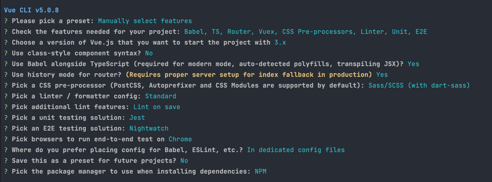

# vuejs.spring-boot.mysql

## 개요

> 오랜 시간 읽지 않았던 책을 읽으며 vuejs 및 spring-boot 학습

## build.gradle 설정하는 이유

├── HELP.md <br>
├── README.md <br>
├── build <br>
├── build.gradle <br>
├── front-end <br>
├── gradle <br>
├── gradlew <br>
├── gradlew.bat <br>
├── out <br>
├── settings.gradle <br>
└── src <br>

front-end 폴더에 vuejs 파일들이 있어 이를 spring-boot 의 앞단을 보여주는 src/main/resources 하위 경로로 이동시켜야함. <br>
이를 ./gradlew clean build (-x test) 명령어를 통해 해결하고자 함.

## install vuejs

```shell
# vue cli 설치
$ npm intall -g @vue/cli

# vue 설치 (원하는 경로에)
$ vue create front-end
```



## 참고

- [vuejs test](https://velog.io/@tkppp-dev/TaskAgile-VTU%EC%99%80-Jest%EB%A5%BC-%ED%86%B5%ED%95%B4)
- [Spring Security 변경사항](https://spring.io/blog/2022/02/21/spring-security-without-the-websecurityconfigureradapter)
